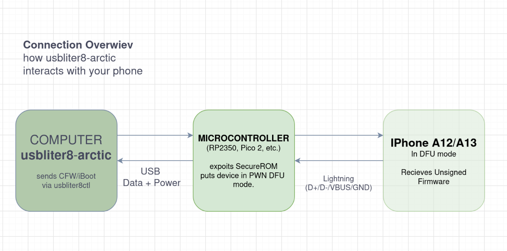
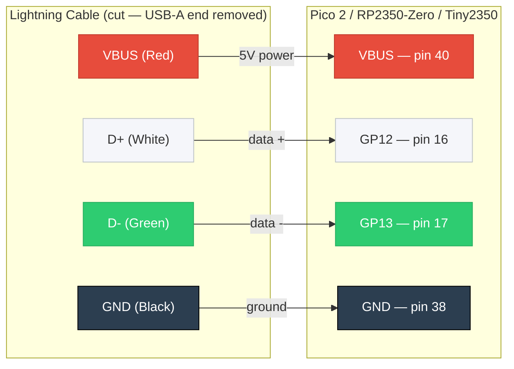

# usbliter8-arctic

> Tethered iOS jailbreak toolkit for A12/A13 devices using usbliter8 exploit chain via RP2350 hardware.

A terminal-based (TUI) hub that automates building and flashing custom firmware, booting ramdisks, and post-exploit setup for iOS devices vulnerable to the usbliter8 SecureROM exploit.

## Supported Devices

| Device | Chip | Board |
|--------|------|-------|
| iPhone XS / XS Max | A12 | d321ap / d331ap |
| iPhone XR | A12 | n841ap |
| iPhone 11 | A13 | n104ap |
| iPhone 11 Pro | A13 | d421ap |
| iPhone 11 Pro Max | A13 | d431ap |
| iPhone SE (2nd gen) | A13 | d79ap |
| iPad mini 5 | A12 | j211ap |
| iPad Air 3 | A12 | j217ap |
| iPad 8 | A12 | j171ap |
| iPad 9 | A13 | j181ap |

## How It Works

1. **RP2350 microcontroller** exploits A12/A13 SecureROM to enter "PWND DFU" mode
2. **PWN DFU** grants unsigned firmware execution — iBoot, kernel, and device tree patches are applied
3. **Custom firmware (CFW)** is built from an Apple IPSW with security bypasses patched in
4. **Tethered boot** — the RP2350 exploit must be reapplied on every cold boot

## Diagrams

### Connection Overview



### Soldered Board Wiring

For boards without a built-in USB-A host port (Pico 2, RP2350-Zero, Tiny2350), cut a Lightning-to-USB-A cable and solder the four internal wires to the GPIO pins:



> ⚠️ **Wire colors vary by brand.** Always verify continuity from the Lightning pin to each wire with a multimeter before soldering.
>
> ⚠️ **VBUS is 5V** — never solder it to the 3V3 pin or you will destroy the board.

## Prerequisites

### Hardware
- **RP2350-based board** (NOT RP2040 — A13 requires RP2350):
  - Waveshare RP2350-USB-A (recommended, no soldering)
  - Raspberry Pi Pico 2
  - Waveshare RP2350-Zero
  - Pimoroni Tiny2350
- Lightning-to-USB-A cable
- Compatible A12/A13 iOS device

### Software
- **Linux** (tested on Debian/Parrot)
- Python 3.9+ with `pyusb` and `pyyaml`:
  ```bash
  sudo apt install python3-usb python3-yaml
  ```
- Binary tools in `tools/` are macOS Mach-O; the interactive menu guides tool handling

## Quick Start

```bash
git clone https://github.com/kaffeindecaf/usbliter8-arctic.git
cd usbliter8-arctic
chmod +x main.py
sudo ./main.py
```

Select options from the interactive menu:

| Key | Action |
|-----|--------|
| `1` / `h` | Hardware setup (wiring, flash firmware, troubleshoot) |
| `2` / `c` | Configure device (select model/iOS offset profile) |
| `3` / `b` | Build custom firmware from IPSW + offsets |
| `4` / `f` | Flash CFW to device (erases all data) |
| `5` | Boot SSHRD ramdisk for filesystem access |
| `6` | Normal boot with patches applied |
| `7` | Post-boot setup (USB network, VNC, SSH, Sileo) |
| `8` / `p` | Check PWN/DFU status |
| `9` / `x` | Health check |
| `0` / `e` | Explain capabilities |
| `q` | Quit |

## CLI Usage

Standalone script interfaces are available:

```bash
# Main menu
sudo python3 ul8.py menu

# USB device detection
python3 pwn_utils.py scan
python3 pwn_utils.py wait

# Offset management
python3 device_offsets.py list
python3 device_offsets.py validate offsets/iPhone12,3_27.0b2.yaml
python3 device_offsets.py find iPhone11,8

# Profile generation
python3 profile_gen.py list
python3 profile_gen.py create iPhone12,3 27.0

# CFW builder (standalone)
python3 cfw_builder.py iPhone12,3_27.0b3.ipsw offsets/iPhone12,3_27.0b3.yaml --check-only
```

## Patch Overview

The CFW builder applies hex patches at precise offsets for each component:

- **iBSS/iBEC** — Image4 validation bypass, boot-args injection, nonce preservation
- **Kernel** — USB restriction removal, sandbox bypasses, AMFI trust, APFS seal/SSV bypass, SEP panic bypass, launchd constraints, debugger unlock
- **Device Tree** — Content protection removal, ephemeral storage enable
- **Restore Ramdisk** — ASR signature bypass, FDR force-succeed
- **Userland daemons** — coreauthd, ctkd, mobileactivationd activation bypass

## Directory Structure

```
usbliter8-arctic/
├── main.py              # TUI menu hub
├── ul8.py               # Standalone launcher
├── boot_chain.py        # Boot/restore/SSH utilities
├── cfw_builder.py       # CFW patching pipeline
├── pwn_utils.py         # USB detection and PWN verification
├── device_offsets.py    # YAML offset profile manager
├── profile_gen.py       # Offset profile generator
├── log_utils.py         # Logging and retry helpers
├── colors.py            # TUI color theme
├── hardware_guide.py    # Hardware setup and firmware flashing
├── offsets/             # Device offset YAML profiles
│   ├── template.yaml
│   ├── sources.yaml
│   └── iPhone12,3_*.yaml
├── tools/               # Binary utilities (img4, img4tool, usbliter8ctl, etc.)
└── firmware/            # Downloaded UF2 firmware files
```

## Warnings

- **This is a tethered jailbreak** — the device will not boot without the RP2350 exploit applied on every cold start
- **Flashing CFW erases all data on the device**
- **Always keep a backup** before flashing
- **Not tested on macOS** — use Linux

## Credits

- [rav000/usbliter8](https://github.com/rav000/usbliter8) — RP2350 firmware and exploit
- [wh1te4ever/usbliter8-fun](https://github.com/wh1te4ever/usbliter8-fun) — CFW scripts and boot chain
- [W0lfSword](https://github.com/W0lfSword) — Kernel offset research
- [Octopus1633/usbliter8-firmware](https://github.com/Octopus1633/usbliter8-firmware) — Prebuilt UF2 binaries
